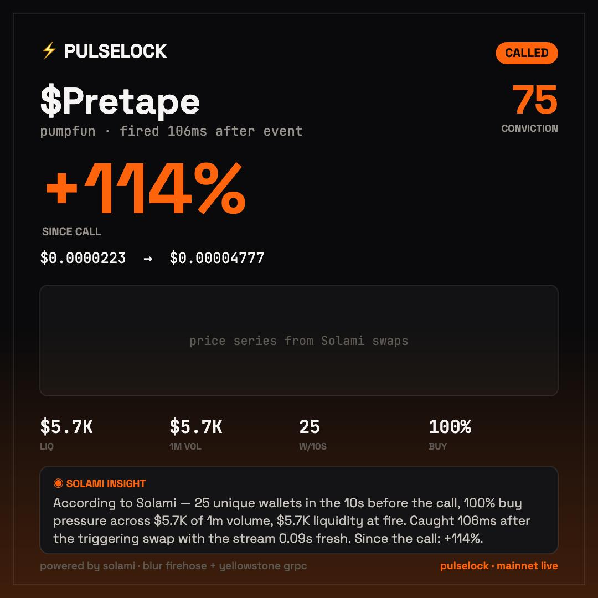
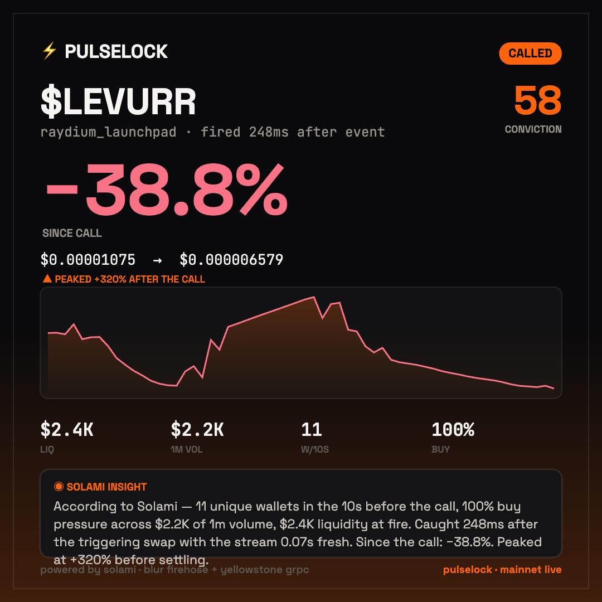
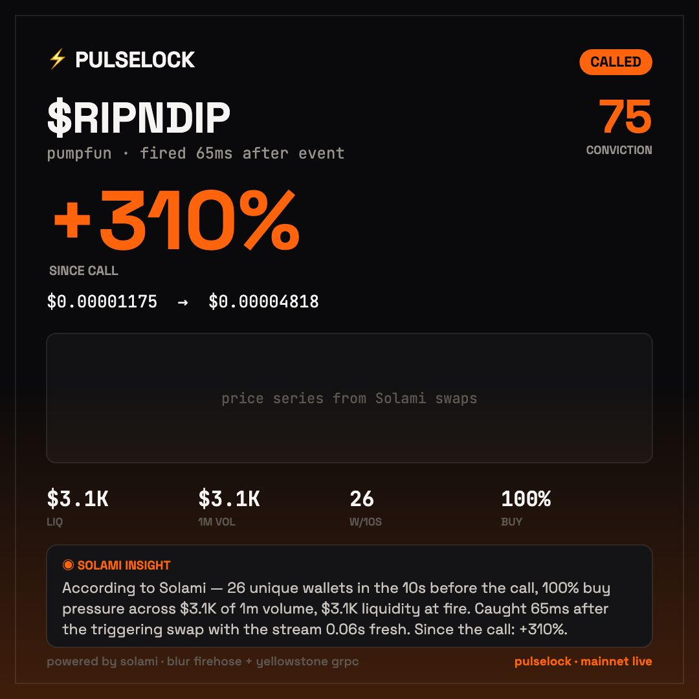

# PulseLock

**A real-time conviction terminal for new Solana tokens.** It watches every pool
launch and trade as it happens, scores each token 0–100 with a *visible breakdown*,
and pushes a phone alert the moment conviction crosses the line — with a one-tap
deep link straight to the trading venue.

> 100% read-only. Zero gas, zero custody, zero keys in the hot path.
> Live on Solana mainnet. Runs on two Solami firehoses.

**▶ [Watch the demo — 2 min, live mainnet](https://youtu.be/CxrWsA5ply8)**

---

## The 30-second version

Hundreds of tokens launch on Solana every day. Most are noise. The ones that rip
do it in **seconds**, and every chart tool tells you *after*. PulseLock flips it:

| | |
|---|---|
| **Watch** | One WebSocket carries *every decoded market event* — trades, launches, liquidity, graduations — across every major DEX. No instruction parsing, ever. |
| **Score** | Each pool gets a conviction score 0–100, rebuilt every second, from four capped signals. Every point is shown: `+16 wallet velocity +30 buy/sell imbalance +0 liquidity +15 volume = 61`. No black box. |
| **Alert** | Score ≥ 75 → Discord + Telegram in **~100–400 ms** from the triggering trade, stamped with the exact latency. |
| **Act** | Every alert carries a pre-filled Photon deep link (pool-keyed, graduation-proof) — alarm → math → execution in seconds. |

There is also a **slot-replay proof**: kill your connection mid-stream and watch the
engine recover every missed Solana slot on reconnect (that's `npm run grpc:test`).

---

## Why this exists

Two problems with every "alpha group" and most bot alerts:

1. **No math.** You get "🚨 $WOJAK buying pressure!" with no idea why. PulseLock shows
   the score *components* on the alert, in the dashboard, and in the terminal — you can
   disagree with it, which is the point.
2. **No honesty about timing.** Conviction alerts fire at peak heat, and memecoins cool
   after. PulseLock's call cards show **price at call → price now → peak since call**,
   so the card can honestly answer "was the alert the exit window?" instead of
   pretending every call is +400%.

Under the hood it's a hybrid of two Solami data paths:

- **Blur** (decoded market events over WebSocket) = *breadth*. Every DEX, every pool,
  ~500 events/sec, all pre-decoded.
- **Yellowstone gRPC** (server-side filtered chain firehose) = *depth*. It idles on a
  cheap slots-only subscription. When a pool's score crosses the deep-dive threshold,
  PulseLock *widens the filter to just that pool* and starts pulling full transactions
  for extra evidence. Bandwidth only grows when it matters.

That last trick — dynamically re-filtering a gRPC subscription mid-stream — is the
part we're proudest of. [Details below.](#how-it-works)

---

## Run it (< 2 minutes)

Prereq: **Node ≥ 24** (PulseLock executes TypeScript natively — no build step).

```bash
git clone <this-repo> && cd pulselock
npm install
cp .env.example .env        # paste your Solami API key
npm start
```

You'll get:

- a live terminal dashboard in your console (top pools, scores, breakdowns)
- the web terminal at **http://localhost:4173/app**
- the landing page at **http://localhost:4173/**

Get a Solami key (Pro free for 7 days — more than enough to run everything here):
**https://solami.dev/signup?ref=st-earn-sep-26**

### Two more commands worth running

```bash
npm run grpc:test   # slot-replay acceptance test: pulls the firehose, we kill it,
                    # it reconnects with fromSlot and recovers every missed slot

npm run demo        # offline synthetic feed through the EXACT same pipeline —
                    # no key needed, zero market data over the wire
```

> Demo mode intentionally shows `blur 0 · grpc 0`: the market feed is a local replay,
> so nothing dials out to Solami. Scoring, alerting, and the Telegram push are all
> still real — the fixtures cross the same thresholds and fire the same alerts.

---

## What the dashboard tells you (metrics)

Everything below is surfaced live in the console mirror and at `/app`:

- **Stream health** — Blur + gRPC connected, reconnect counts, gRPC pongs,
  event freshness (ms since last market event), current Solana slot
- **Throughput** — total events ingested this run (live counter), pools tracked
  (~43,000+ on our first day), deep-dive subscriptions active
- **Per pool** — score with full breakdown, age since launch, liquidity, 60s volume,
  unique wallets (10s window), buy pressure, DEX
- **Alerts** — every fired alert with its score, **latency in ms from trigger trade**,
  price at call, price now, **peak since call**, and its Photon deep link
- **Subscriptions** — self-serve Telegram subscriber count (see below)

---

## How it works

```
Solami Blur WS ───────── every decoded event ────┐   breadth: all DEXes, all pools,
 trades · launches · liquidity · memes           │   ~500 ev/s, zero parsing
 graduation · surge · token updates              │
                                                 ├─→  Registry (in-memory)
Solami Yellowstone gRPC ─ slots, always on ──────┤     rolling 10s / 60s windows
   (fromSlot replay on reconnect)                │        │
                                                 │        ↓
   tx filter on hot pools only (≤5) ─────────────┘   Conviction score 0–100
   server-side filtered, rewritten live              with visible breakdown
                                                          │
                                             ┌────────────┼─────────────┐
                                             ↓            ↓             ↓
                                       console/web   ≥75 → alerts   ≥60 → gRPC
                                        dashboard    Discord/Telegram  tx deep-dive
```

**Two streams, three jobs.**

1. **Blur does breadth.** One subscription (`wss://ws.solami.dev/data/subscribe`)
   carries every decoded event across Raydium, PumpSwap, Meteora and friends.
   PulseLock never parses an instruction — trades arrive as `{ side, volume_usd,
   price_usd, trader }`. Events feed rolling windows: unique wallets (10s), buy
   ratio, volume and liquidity added (60s).

2. **gRPC idles cheap, then zooms in.** The Yellowstone subscription starts
   **slots-only** — the chain's heartbeat, used for freshness and replay. When a pool
   crosses `DEEP_DIVE_THRESHOLD` (60), its account is added to the subscription's
   transaction filter and full txs start flowing **for that pool only**. The filter
   is rewritten atomically per update (capped at 5 pools), so bandwidth stays flat
   until conviction says otherwise.

3. **Replay closes gaps.** On any reconnect, the subscription re-arms with
   `fromSlot = lastSeen + 1`, and the server replays everything the connection
   missed. This is the wifi-kill demo: drop the network mid-stream, reconnect, and
   the missed slots arrive — 31 recovered in our acceptance run.

A pool's state machine: `idle (<55) → watch (≥55) → deep (≥ alert threshold)`.
Deep pools alert on every threshold crossing; the gRPC deep-dive can start one notch
earlier so the evidence is already arriving when the alert fires.

---

## The score, in full

Four weighted signals, each individually capped so no single metric can own the
result, summed and clamped to 100. Straight from `src/score.ts` — there is nothing else:

| Signal | Max | Formula |
|---|---|---|
| Unique wallet velocity | **30** | unique traders in last 10s × 1.2 |
| Buy/sell imbalance | **30** | buy ratio (0–1) × 30 × confidence |
| Liquidity added 60s | **25** | USD liquidity added in 60s ÷ 400 |
| Volume momentum 60s | **15** | USD volume in 60s ÷ 100 |

**The confidence gate** — the anti-footgun:

```
confidence = min(1, trades60 / 6)
```

A pool with 1–5 trades in the last minute has its imbalance and volume votes scaled
down, so **one lucky $40k buy can't spike the score**. It takes a crowd.

Worked example, from a real live session:

```
+16 unique wallet velocity +30 buy/sell imbalance +0 liquidity added 60s
+15 volume momentum 60s = 61
```

Every alert, dashboard row, and call card renders this breakdown verbatim.

---

## Alert anatomy

When a pool crosses the threshold, within ~100–400 ms of the trigger trade:

- **Discord + Telegram** message: token, DEX, score with breakdown, latency stamp
- **Call card** on the dashboard: sparkline, price at call → now → **peak since call**,
  PnL honestly labeled, breakdown
- **Photon deep link**: `/en/lp/{pool}` when the pool exists, mint fallback when it
  graduates (we tested both paths — links survive graduation)
- **Self-serve Telegram**: dashboard CTA → t.me bot → `/start` → poll loop registers
  you in ≤25 s → every alert broadcasts to every subscriber. No manual chat IDs.

Latency is measured honestly: `alert timestamp − triggering event timestamp`,
stamped on every alert. Our live runs landed between **35 ms and ~1 s, typically
100–400 ms**.

---

## PulseLock in action

Real call cards from live mainnet sessions. Each card carries the score breakdown,
the latency stamp, and the honest PnL line: **price at call → price now → peak since
call**. Note the pattern the engine is designed for — price-now often cools after
conviction peaks, and the **peak chip shows the alert was the exit window**. That's
the claim, verified per card, not a trading-pitch.

<p align="center">
  
  
  
</p>

<!-- Optional: swap the caption below for exact figures from the cards,
     e.g. "PEAK SINCE CALL +38% · PRICE NOW −6% — score 75, 140 ms" -->

---

## Solami stack fit — what we used and what we cut

The bounty stack has seven pieces. We deliberately run **two**, deeply, rather than
seven shallowly:

| Piece | Verdict | Why |
|---|---|---|
| **Blur** | ✅ **Core** | The entire market feed. Decoded events over one WS; the score eats it. |
| **Yellowstone gRPC** | ✅ **Core** | Slots for freshness + `fromSlot` replay; server-side filtered tx deep-dives on hot pools, rewritten live. |
| Mirage | Evaluated, cut | Same Yellowstone data over plain WS — redundant when you already run real gRPC. Kept in mind as a no-gRPC-client fallback. |
| Data API | Evaluated, cut | Historical/indexed lookups; our engine derives all state live from streams. Post-bounty: backtesting the score against history. |
| Webhooks | Evaluated, cut | Push-to-your-HTTP-endpoint needs a public URL and per-event requests; a held stream wins on latency, ordering, and dedup (470 ev/s as individual POSTs is not a latency play). We *deliver* alerts via Discord/Telegram webhooks — outbound. |
| Beam | Evaluated, cut | Transaction landing = sending. PulseLock is deliberately read-only: zero custody, zero key risk. This is the documented v2 execution layer (below). |
| RPC/WS | Evaluated, cut | Everything we need arrives push-first on the two streams above; no polling loops exist in the codebase. |

**The one-sentence version:** a read-only conviction engine whose entire data path is
two Solami firehoses — breadth from Blur, depth from a gRPC filter that widens only
when conviction says so, with slot replay as the safety net.

---

## Honest limits

- **Alerts fire at heat, not at bottoms.** Memecoins cool after conviction peaks; most
  alerts will show negative PnL at price-now. The **peak-since-call** chip is the honest
  read: it shows whether the alert *was* the exit window. We claim catching the move,
  not printing money — there's no execution layer to claim otherwise (yet).
- **Demo ≠ live.** `npm run demo` replays fixtures through the real pipeline so you can
  develop keyless; the header shows the market feed is offline by design. Judged runs
  use live mainnet.
- **Event logging is off by default.** The raw firehose is *big* — live JSONL logging
  wrote gigabytes per day in our runs. Set `LOG_EVENTS=1` only when you want the capture.
- **Bandwidth:** the live Blur feed pulls on the order of tens of GB per day. Don't run
  the live engine long-term on a phone hotspot; the demo and replay test are cheap.

---

## Config

All env vars (only the first is required):

| Var | Default | Purpose |
|---|---|---|
| `SOLAMI_API_KEY` | — | **Required.** Blur WS auth + gRPC token fallback |
| `SOLAMI_WS_ENDPOINT` | `wss://ws.solami.dev/data/subscribe` | Blur WS base URL |
| `SOLAMI_GRPC_ENDPOINT` | `https://grpc.solami.dev` | Yellowstone gRPC endpoint |
| `SOLAMI_GRPC_TOKEN` | falls back to `SOLAMI_API_KEY` | gRPC `x-token` metadata |
| `ALERT_THRESHOLD` | `75` | score → alert fires |
| `DEEP_DIVE_THRESHOLD` | `60` | score → gRPC filtered tx subscription |
| `MIN_LIQUIDITY_USD` | `2000` | pool eligibility floor |
| `LOG_EVENTS` | `0` | `1` = write raw event JSONL (large!) |
| `PORT` | `4173` | web server port |
| `DISCORD_WEBHOOK_URL` | — | alert sink |
| `TELEGRAM_BOT_TOKEN` | — | alert sink + self-serve subscriber poll |
| `TELEGRAM_CHAT_ID` | — | optional bootstrap subscriber |
| `TELEGRAM_BOT_USERNAME` | — | shown on the dashboard CTA |

Tuning tip: run with `ALERT_THRESHOLD=60 DEEP_DIVE_THRESHOLD=45` for a choppier,
noisier feed — good for seeing the score move without waiting for a genuine
high-conviction pool.

---

## Project layout

```
src/
  index.ts     engine entry: wiring, 1s tick, console mirror
  blur.ts      Solami Blur WS — decode, reconnect, event tap
  grpc.ts      Yellowstone gRPC — slots, dynamic tx filter, fromSlot replay
  aggregate.ts Registry — rolling windows, pool state, dedup
  score.ts     the conviction score (four signals, capped, explainable)
  alerts.ts    threshold logic, alert history, Discord/Telegram broadcast
  telegram.ts  self-serve subscriber poll + broadcast
  server.ts    HTTP: landing, /app dashboard, /api snapshot
  demo.ts      synthetic fixture feed (offline dev/testing)
  format.ts    shared formatting spec (USD, pct, age)
  log.ts       event counter + optional JSONL (LOG_EVENTS)
  config.ts    env parsing
public/        landing page + /app dashboard (vanilla JS, canvas call cards)
mockup/        original dashboard spec the formatting follows
PLAN.md        full build plan, cut list, and decision log
```

---

## Roadmap

- **v2 — execution layer (Solami Beam).** The documented scope cut: this build stays
  read-only and ships conviction → venue deep links. v2 closes the loop — one-tap
  swap straight from the call card, with the same visible math attached to the trade.
- **Score backtesting via Data API.** Replay the conviction score against indexed
  history to tune weights with evidence instead of vibes.

---

## License

MIT
